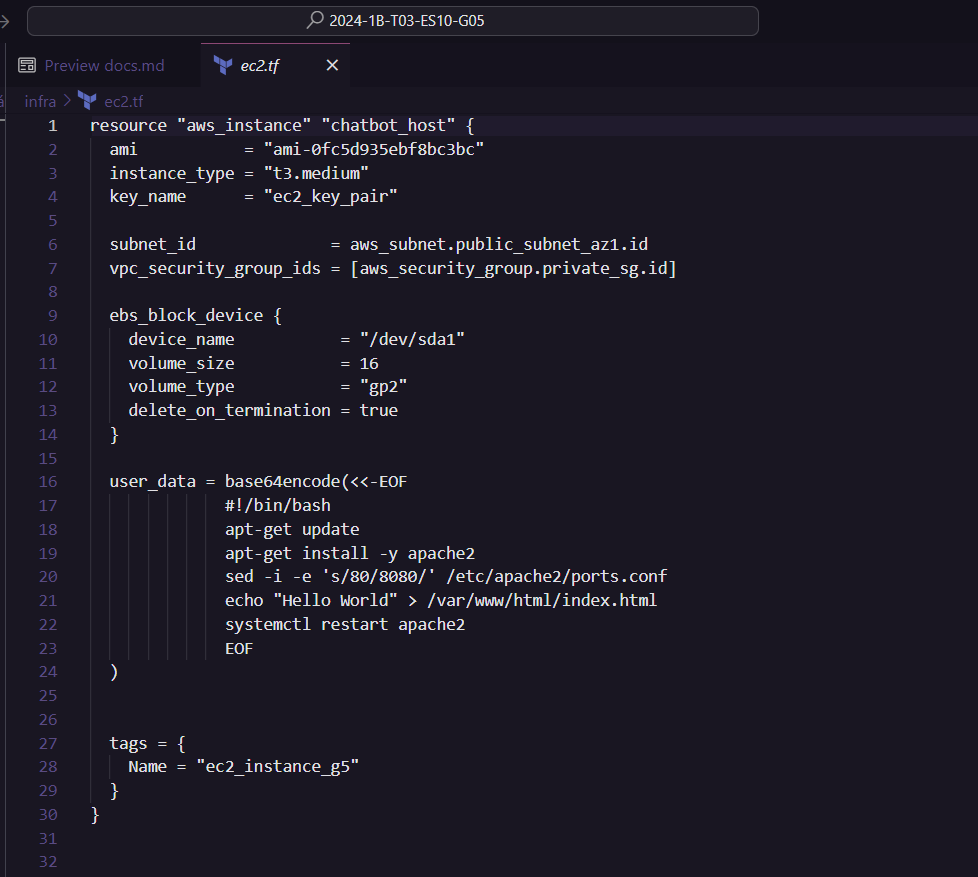

# AtividadeLiviaC-S5M10-GitHubActions-AWS

### Enunciado da atividade

Leia o artigo proposto no autoestudo e redija um texto técnico abordando os seguintes temas:
 
- TEMA 1 - A importância de CI/CD no desenvolvimento de software e como ele melhora a eficiência dos times de desenvolvimento.
- TEMA 2 - A estrutura e os componentes principais de um workflow do GitHub Actions.
- TEMA 3 - A função e a importância do AWS CloudFormation na automação da infraestrutura. Anexe e explique o template que você está usando no seu projeto para criar a instância EC2.
- TEMA 4 - Discuta como a integração de GitHub Actions com AWS CloudFormation e Amazon EC2 pode ser aplicada em projetos reais. Quais desafios você encontrou no seu projeto e como os solucionou?

#### Link do artigo proposto:
- https://aws.amazon.com/pt/blogs/devops/integrating-with-github-actions-ci-cd-pipeline-to-deploy-a-web-app-to-amazon-ec2/

# Atividade

## A importância de CI/CD no desenvolvimento de software e como ele melhora a eficiência dos times de desenvolvimento.

Abaixo será tratado sobre a importância da prática de CI/CD no dev de software e como ela contribui significativamente para a eficiência dos times de desenvolvimento.

A adoção de práticas de CI/CD permite que as equipes de desenvolvimento automatizem e simplifiquem o processo de desenvolvimento de software e gerenciamento de infraestrutura. Isso vai não apenas acelerar o ritmo de inovação, como também melhorar a qualidade e a consistência dos lançamentos de software.  
O CI/CD é uma parte essencial das práticas de DevOps, que visam quebrar as barreiras entre as equipes de desenvolvimento e operações, promovendo uma cultura de colaboração contínua.

- **Continuous Integration** envolve a integração contínua de código em um repositório compartilhado várias vezes ao dia. Isso permite que erros sejam detectados mais cedo, já que cada alteração no código é automaticamente testada. A detecção precoce de erros facilita a correção de problemas antes que eles se tornem grandes e difíceis de resolver.

- **Continuous Delivery**, por outro lado, leva essa automação um passo adiante ao automatizar o processo de liberação do software para um ambiente de produção. Cada mudança de código é preparada para uma possível liberação, permitindo que os desenvolvedores entreguem novas funcionalidades, correções de bugs e melhorias de forma rápida e eficiente.

Um exemplo da implementação de CI/CD é a integração de GitHub Actions com AWS CodeDeploy, conforme descrito no artigo proposto (link acima). Assim, as GitHub Actions são usadas para orquestrar um pipeline de CI/CD que constrói, testa e implanta uma aplicação Java SpringBoot em instâncias do Amazon EC2 em um grupo de autoescalamento.

Essa configuração oferece algumas vantagens, como:

- **Automação completa:** desde quando o código é comitado no repositório GitHub até a implantação na infraestrutura de produção, todos os passos são automatizados. Isso reduz a possibilidade de erros humanos e garante consistência no processo de implantação.

- **Feedback rápido:** com a integração contínua, quem está desenvolvendo, recebe feedback rápido sobre o impacto de suas alterações, o que permite a correção rápida de problemas e a manutenção da qualidade do código.

- **Escalabilidade:** com serviços como AWS Auto Scaling e CodeDeploy, a aplicação pode ser escalada automaticamente de acordo com a demanda, mantendo a disponibilidade e desempenho do serviço.

- **Segurança:** o uso de provedores de identidade como IAM OIDC permite a integração segura entre GitHub e AWS, eliminando a necessidade de manter segredos e credenciais sensíveis no repositório.

## A estrutura e os componentes principais de um workflow do GitHub Actions.

Um workflow do GitHub Actions é um processo automatizado configurado para facilitar diversas etapas do desenvolvimento de software, como build, teste, package, release e deploy. 

Componentes principais que fazem parte dessa estrutura:

#### 1. **Actions**
São as unidades individuais de tarefa que podem ser combinadas para criar um workflow.  
Devemos pensar nelas como peças de um quebra-cabeça, onde cada peça executa uma função específica.  
Por exemplo, uma action pode compilar o código, outra pode executar testes, e outra ainda pode fazer o deploy do aplicativo.

#### 2. **Workflows**
São processos automatizados personalizados que são configurados no repositório do GitHub. Eles são definidos em arquivos YAML dentro da pasta `.github/workflows`.  
Cada workflow é composto por várias actions, organizadas em etapas. Essas etapas podem ser desencadeadas por eventos específicos, como um push no repositório ou a criação de um pull request.

#### 3. **Eventos que disparam workflows**
- **`push:`** disparado quando há um push de código para o repositório.
- **`pull_request:`** disparado quando um pull request é criado ou atualizado.
- **`workflow_dispatch:`** permite disparar o workflow manualmente.

#### 4. **Stages e jobs**
Dentro de um workflow, podem ser definidos diferentes stages e jobs. 
Cada job é uma sequência de passos que serão executados. Por exemplo, um workflow pode ter um job para build e outro para deploy. Jobs podem ser configurados para rodar em paralelo ou em sequência, dependendo das dependências entre eles.

#### 5. **Runner**
É o ambiente onde as actions são executadas. 
  O GitHub Actions oferece runners hospedados por eles mesmos (self-hosted) ou pode ser configurado o seu próprio runner. Isso proporciona flexibilidade para rodar workflows em diferentes ambientes, como sistemas operacionais específicos ou com requisitos de hardware particulares.

#### 6. **Secrets**
Para manter a segurança, informações sensíveis como tokens de autenticação ou credenciais são armazenadas como secrets. Esses secrets são configurados no repositório e são usados dentro do workflow sem serem expostos no código. Por exemplo, um token de acesso AWS pode ser armazenado como um secret e referenciado durante o deploy.

### Exemplo de workflow com deploy na AWS

Exemplo prático de como um workflow do GitHub Actions pode ser usado para um deploy na AWS utilizando AWS CodeDeploy. 

1. **Desencadeamento do workflow:** O workflow é acionado quando há um push para o branch principal do repositório.
2. **Build do aplicativo:** Primeiro, o código é compilado e os testes são executados.
3. **Upload dos artefatos:** O artefato resultante (por exemplo, um arquivo WAR de um aplicativo Spring Boot) é carregado para um bucket do Amazon S3.
4. **Deploy com codeDeploy:** O CodeDeploy é invocado para implantar o artefato nas instâncias Amazon EC2 dentro de um grupo de autoescalamento (Auto Scaling Group).
5. **Verificação do deploy:** Após o deploy, o status pode ser verificado no console do AWS CodeDeploy.

### Estrutura do repositório

- **.github/workflows/deploy.yml:** Define o workflow do GitHub Actions.
- **aws/scripts:** Scripts para diferentes eventos do ciclo de vida do deploy.
- **cloudformation/template.yml:** Template para criar os recursos necessários na AWS.
- **appspec.yml:** Necessário pelo CodeDeploy para gerenciar o deploy nas instâncias EC2.

## A função e a importância do AWS CloudFormation na automação da infraestrutura. Anexe e explique o template que você está usando no seu projeto para criar a instância EC2.

O AWS CloudFormation é uma ferramenta fundamental para automatizar a criação e gerenciamento da infraestrutura na nuvem da Amazon. Com ele, é possível definir toda a infraestrutura como código, o que significa que podemos descrever os recursos necessários em um arquivo e provisioná-los de maneira consistente e escalável. Isso simplifica muito o processo de implantação, garantindo que a infraestrutura seja replicável e controlada por versão. Em resumo, o CloudFormation é essencial para automatizar a infraestrutura na nuvem, trazendo eficiência e confiabilidade para os projetos.
 
 

Acima temos um print do código que está sendo utilizado pelo grupo 5 para a automatização da criação e configuração de uma instância EC2 que hospeda um servidor web básico.

 

- Utiliza uma imagem AMI específica e uma instância de tipo t3.medium.
- É associada a um par de chaves para acesso SSH.
- É implantada em uma sub-rede específica e associada a um grupo de segurança.
- Inclui um volume EBS para armazenamento, configurado para ser excluído ao terminar a instância.
- Executa um script de inicialização que instala o servidor web Apache, configura-o para ouvir na porta 8080, cria uma página HTML simples e reinicia o serviço Apache.
- A instância é identificada com a tag Name definida como ec2_instance_g5.

## Discuta como a integração de GitHub Actions com AWS CloudFormation e Amazon EC2 pode ser aplicada em projetos reais. Quais desafios você encontrou no seu projeto e como os solucionou?

A integração de GitHub Actions com AWS CloudFormation e Amazon EC2 é uma ótima combinação para automatizar e gerenciar a infraestrutura de projetos reais.  
O GitHub Actions permite criar fluxos de trabalho automáticos que podem ser acionados por eventos no repositório, como push ou pull requests. Quando integrado com AWS CloudFormation, é possível definir a infraestrutura como código, o que facilita a replicação, atualização e manutenção do ambiente de desenvolvimento e produção.

Por exemplo, em um projeto, pode-se configurar um GitHub Action para, automaticamente, iniciar um template do CloudFormation sempre que houver uma atualização no código. Esse template pode descrever os recursos necessários, como instâncias EC2, bancos de dados, redes etc.  
Assim, toda vez que um desenvolvedor fizer uma alteração no código e essa mudança for mergeada na branch principal, o GitHub Action dispara, o CloudFormation atualiza a infraestrutura e a nova versão do aplicativo é implantada nas instâncias EC2.

Isso não só automatiza o processo de implantação, mas também garante consistência e controle de versão da infraestrutura, reduzindo erros humanos e aumentando a eficiência. Em suma, essa integração é útil para qualquer projeto que precise de implantação contínua e gerenciamento de infraestrutura em nuvem.

**Desafios - Grupo 5:**

- **Complexidade na integração:** a integração inicial entre GitHub Actions, AWS CloudFormation e CodeDeploy demandou um conhecimento aprofundado de cada serviço e de suas interações.

- **Segurança na configuração:** assegurar a gestão segura de segredos e credenciais, evitando que os segredos da AWS fossem expostos.

- **Configurações incorretas:** problemas na configuração dos templates do CloudFormation podem causar falhas na criação de recursos, o que ocasiona atrasos no processo.

**Soluções - Grupo 5**

- **Documentação e automação de scripts:** uma solução foi o desenvolvimento de  scripts e documentações detalhados para automatizar e documentar cada etapa do processo de integração, o que facilita tanto a configuração quanto a resolução de problemas.

- **Implementação de OIDC e IAM Roles:** isso foi feito com o intuito de aumentar a segurança, o que permitiu que o GitHub Actions interagisse com a AWS sem a necessidade de armazenar credenciais longas.

- **Validação de templates:** visando minimizar erros de configuração, utilizamos ferramentas de validação e linting. Isso assegurou que os templates do CloudFormation estivessem corretos antes da sua aplicação.